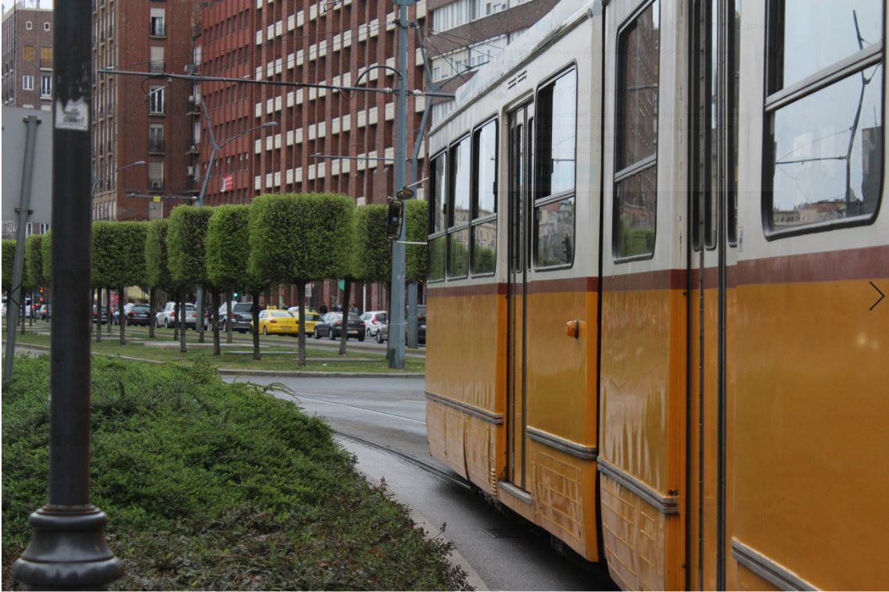
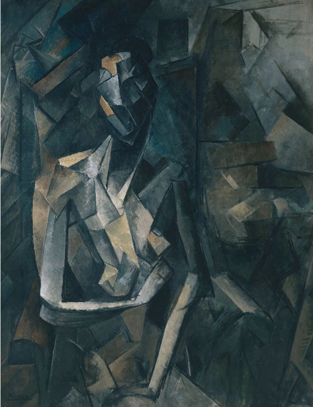
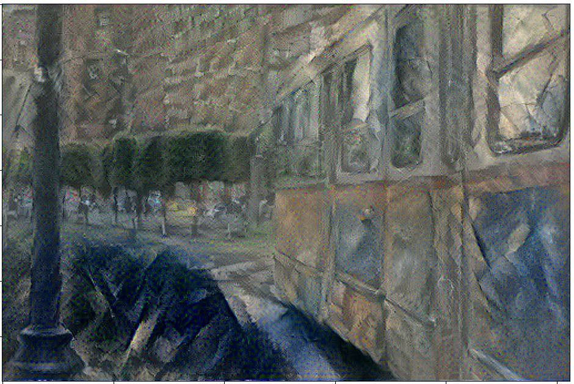
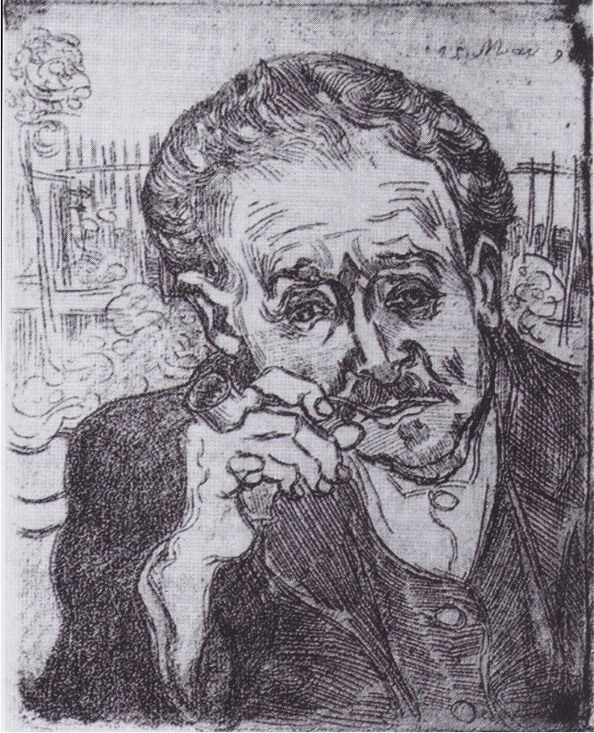
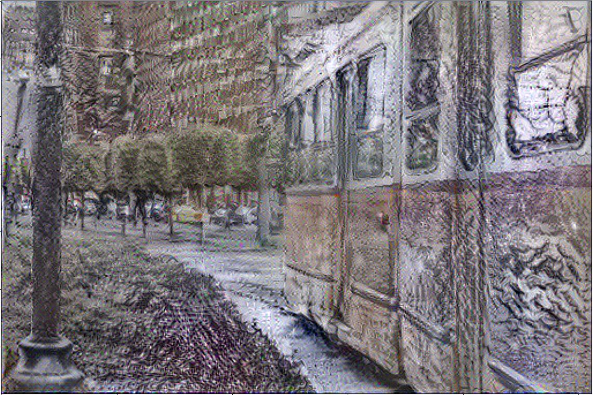

# Deep Neural Style Transfer

The style transfer procedure refers to transfering the style of an image
(eg. the style of a painting) to another image (refered as content image)
by keeping the original structure and shapes of the content image.
 
For example by combining the images:

 

We can obtain the result:

 

We will use a model pretrained for recognizing complex structures and shapes
like VGG19 which can be downloaded and load the imagenet weights.
 
The model is based on 16 filters (convolutions) and the head part is composed from 
several fully connected layers (used to flatten the tensor and clasify the images), but we will
not need the top part of the model (because we are only interested in the filters and shapes extracted from
the convolutios).
 
The style of an image can be extracted from several layers Conv1_1, Conv2_1, Conv3_1, Conv4_1, Conv5_1 and the content
layer can be extracted from the same layers, but we will use the Conv5_2 block to simplify the process.
 
We will have a third image that should be initialized with random noise, and modify it until it activates the specified layers at the same level as the style and content images (to reduce the computing time we can start with the original content image, such that it has fewer steps to do until it finds an image that keeps the content of the original image). 
 
We will compute the loss between our image and the content and style images at the specified layers by using a gram matrix "difference".
 
To ensure that we keep the original content while introducing a new style into our image we will use two different error weights (a smaller one for the style weight).

Other results:

 

Result:

 

More info can be found in the paper:
 
<a href="https://arxiv.org/abs/1508.06576">"A Neural Algorithm of Artistic Style"<a/> - Leon A. Gatys, Alexander S. Ecker, Matthias Bethge
 

